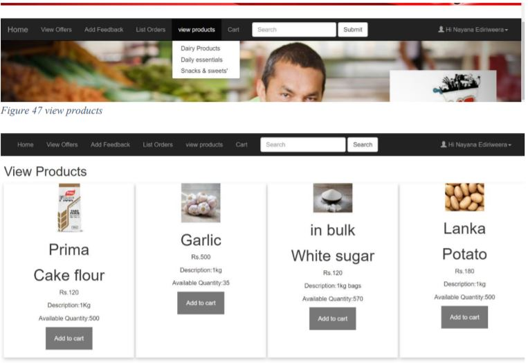

# Web Based Shopping Assistant System 

A web application project done as a partial requirement for the degree of Bachelor of Science in Management and Information Technology (B.Sc. MIT), University of Kelaniya, Sri Lanka.

## People
* Developed by : [Anuradha Jayatilaka](https://anuradhajayatilaka.github.io)
* Advised by : Dr. Chathura Rajapakshe
* Client: [Singhe Super](https://g.page/singhe-super-karalliyadda?share)

## Technologies
Technologies : PHP, HTML, CSS, JS, MySQL

## Documentation
* [Proposal](./docs/proposal.pdf)
* [Report](./docs/report.pdf)
* [Presentation](./docs/presentation.pdf)

## Screenshot

## Getting started

### Server requirements
* Apache Server
* MySQL Server
* PHP

### Steps
1. Download the source code
    > git clone https://github.com/anuradhajayatilaka/shopping-assistant-system.git
2. Add the MySQL credentials to 
    > mysqlconnect.php
3. Run the database connection script
    > mysql -u root database.sql
4. Now you can access the website using the browser.

## Support
Contact anuradha[dot]n[dot]jayatilaka[at]gmail[dot]com